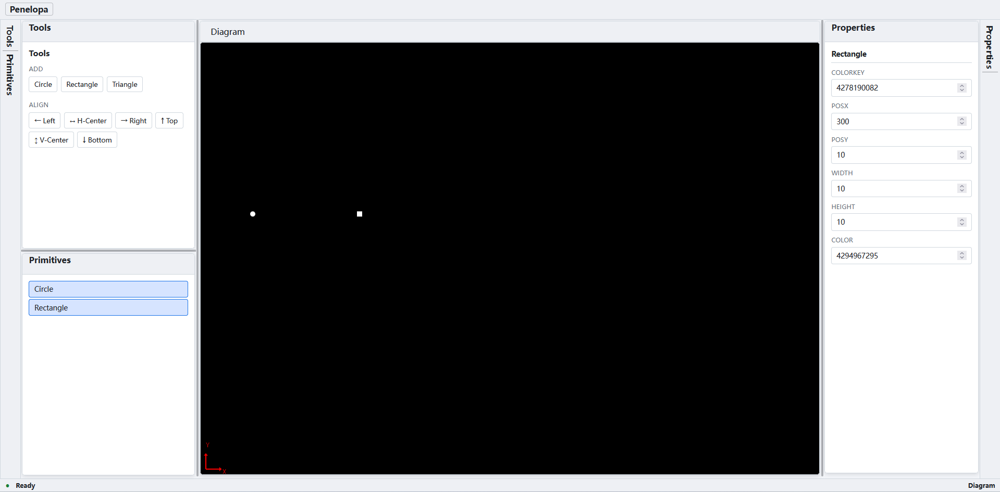

# Penelopa

English | [简体中文](README.zh.md)

**A primitive alignment editor for Blazor WebAssembly.**

Penelopa hosts a SkiaSharp drawing canvas, a primitive tree, alignment actions, and a property editor inside a six-region dockable workspace, and provides six-direction alignment (left / horizontal-center / right / top / vertical-center / bottom) for circle, rectangle, and triangle primitives.

> **Live demo:** https://wubing7755.github.io/Penelopa/

## Preview



Six-region dockable workspace: SkiaSharp drawing canvas, primitive tree, alignment tools, and property editor.

## Features

- Six-region dockable workspace with top toolbar and status bar
- Symmetric side docks (300px each) around a full-height drawing canvas
- SkiaSharp canvas with color-key hit testing (canvas resizes with its panel)
- Circle / Rectangle / Triangle primitives with an editable property system
- Six-direction alignment against the union bounding box, with idempotence
- Property editor driven by the primitive property model
- Bright studio light/dark skin driven by `--penelopa-*` CSS variables

## Project Structure

| Project                  | Responsibility                                          |
| ------------------------ | ------------------------------------------------------- |
| `src/Penelopa`           | Blazor WebAssembly app hosting the dockable workspace   |
| `src/Penelopa.Core`      | UI-independent primitive model and alignment algorithms |
| `src/Penelopa.Rendering` | SkiaSharp canvas rendering and hit testing              |
| `tests/`                 | xUnit test projects for Core and Rendering              |

`Penelopa.Core` does not depend on Blazor or SkiaSharp. Browser input on the canvas is converted into a hit test against the color-key buffer, committed through the shared primitive service, and projected back by Blazor into the panels.

## Development

Requirements:

- .NET 6 SDK (`global.json` pins 6.0.428)
- `wasm-tools` workload — required by the SkiaSharp WebAssembly native assets:

```sh
dotnet workload install wasm-tools
```

- SkiaSharp is pinned to **2.88.9** (the last stable line that supports net6.0 WebAssembly; 4.x requires net8.0+).

```sh
dotnet restore Penelopa.sln
dotnet build Penelopa.sln --no-restore
dotnet test Penelopa.sln --no-build --no-restore
dotnet format Penelopa.sln --verify-no-changes --no-restore
```

Run the app:

```sh
dotnet run --project src/Penelopa
```

## Documentation

| Document                                     | Content                                                 |
| -------------------------------------------- | ------------------------------------------------------- |
| [Architecture (en)](docs/en/architecture.md) | Layers, rendering, alignment semantics, toolchain notes |

## License

Penelopa is released under the [MIT License](LICENSE).
